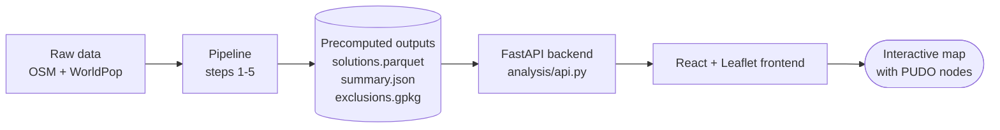

# How the Accra PUDO Network Planner Works

This document explains, end to end, how the system decides **where to place
Pick-Up / Drop-Off (PUDO) points** across Greater Accra + Kasoa — from raw
population and map data, through the optimisation, to the interactive map.

It answers one question:

> **How many PUDO points do we need so that everyone lives within an X-minute
> walk of one — and exactly where should they go?**

Both *X* (walking time) and the coverage target (% of people served) are
adjustable in the app, and the answer updates instantly.

---

## 1. The big picture



The heavy lifting happens **once**, offline, in a 5-step Python pipeline. It
produces a ranked list of PUDO sites. The web app never re-runs the analysis —
it just reads those precomputed results and draws them.

**Study area:** the Greater Accra Region **merged with Kasoa** (Awutu Senya East
Municipal District, Central Region) into a single boundary. They are always
treated as one area, never split.

---

## 2. The data we start from

| Source | What it gives us |
|---|---|
| **WorldPop 2020** (100 m constrained, UN-adjusted) | Population — how many people live in every 100 m × 100 m cell. |
| **OpenStreetMap** (Ghana extract from Geofabrik) | The walking road network, plus land-use polygons (water, forests, industrial zones, etc.) and private/gated roads. |
| **Nominatim** | The study-area boundary polygon (Greater Accra + Kasoa). |

Total population inside the study area after processing: **≈ 5.22 million people.**

---

## 3. The pipeline, step by step

Each step is a script in `analysis/pipeline/`. Run in order by
`analysis/run_pipeline.py`.

### Step 1 — Download (`step01_download.py`)
Fetches the study-area boundary (Nominatim), the Ghana OSM extract (`.pbf`), and
the WorldPop population raster. Skips anything already downloaded.

### Step 2 — Extract the walking network & exclusion zones (`step02_extract_osm.py`)
Parses the OSM data into three things:

1. **A pedestrian graph** — every walkable road/path becomes edges between
   junction nodes. Roads a customer *can't* walk (motorways, `foot=no`, and
   **private/gated** roads) are removed. Only the largest connected component is
   kept (so no unreachable islands).
2. **Exclusion zones** — polygons where a PUDO may **never** be placed:
   **water, rivers** (centre-lines buffered 15 m), **wetlands, forests,**
   industrial & military zones, airports, cemeteries, and landfills.
3. **Gates** — see §5 below.

### Step 3 — Build demand points (`step03_demand.py`)
Every populated 100 m WorldPop cell becomes a **demand point** weighted by how
many people live there. Each cell is *snapped to the nearest walking-network
node*. Cells more than 500 m from any road are dropped (≈ 4.8 % of people, mostly
un-served remote areas). Result: population attached to network nodes.

### Step 4 — Generate candidate PUDO sites (`step04_candidates.py`)
Candidate locations are network junctions that:
- lie inside the study area,
- are **not** inside any exclusion zone (buffered 25 m),
- are thinned to **one candidate per 250 m** (junctions with more street
  connections preferred),
- **plus every detected gate** is force-added (§5).

This yields the pool of ~24,000 places a PUDO *could* go.

### Step 5 — Solve the coverage problem (`step05_solve.py`)
This is the core. For each walking-time threshold **X ∈ {5, 7, 10, 12, 15, 20} min**:

1. **Compute reach.** From every candidate, run a distance-limited Dijkstra over
   the walking graph to find which demand points are within an **X-minute walk**
   (at 80 m/min ≈ 4.8 km/h — *real network distance, not straight-line*).
2. **Greedy set cover.** Repeatedly pick the candidate that covers the **most
   not-yet-covered people**, mark those people covered, and repeat. This is done
   with a lazy-greedy (CELF) algorithm for speed. It produces a **ranked list**
   of PUDO sites, best-impact first.

The greedy ranking is the clever part: **the first *k* sites of the list are the
(near-optimal) solution for whatever coverage they reach.** So to answer "how
many nodes for 95 % coverage at a 10-min walk?", you just take sites from the top
of the 10-min list until their cumulative population hits 95 %. That's why the
app's two sliders respond instantly — no re-solving needed.

**Outputs** (`analysis/outputs/`):
- `solutions.parquet` — every ranked site per threshold, with lat/lon, people
  served, and cumulative coverage.
- `summary.json` — totals and how many nodes hit 80/90/95/99/100 % per threshold.

---

## 4. Why the greedy method (and how good is it?)

Placing the *fewest* points to cover a target population is the **maximum
coverage / set-cover** problem — NP-hard to solve exactly at this scale. The
greedy algorithm is the standard practical approach and is provably within a
small factor of optimal (typically within a few % of the exact ILP solution),
while running in minutes instead of days. Ranking by marginal population gain
also gives us the "any coverage target, instantly" property above.

---

## 5. Exclusions & gated communities

**Exclusions** answer *"don't put a pickup point in the middle of a lake / river
/ forest / industrial estate."* Any candidate falling inside one of these
(buffered) polygons is discarded in Step 4.

**Gated communities** are handled specially. A customer can't walk a gated
estate's internal (private) roads, so those roads are removed from the network.
But residents still need service — so the PUDO goes **at the gate**:

> A **gate** = a node shared by a gated/private road **and** the public street
> network — i.e. exactly where residents exit the estate onto a public road.

Step 2 detects these gates (private-road nodes ∩ public-network nodes) and Step 4
force-includes them as candidates. The solver then places a PUDO at a gate when
that's the most efficient way to serve the community. Even where it doesn't, gated
residents' demand snaps to the public node at their gate, so they're covered from
the entrance regardless.

---

## 6. The backend API (`analysis/api.py`)

A thin FastAPI layer reads the precomputed outputs and serves them as JSON /
GeoJSON. It does **no** heavy computation — just slices the ranked list.

| Endpoint | Returns |
|---|---|
| `GET /api/summary` | Total population, the walking-time thresholds, per-threshold coverable %. |
| `GET /api/nodes?minutes=&coverage=` | The greedy-optimal node set for that walking time + coverage target (lat/lon, people served, cumulative %). |
| `GET /api/boundary` | Study-area outline (GeoJSON). |
| `GET /api/exclusions` | Exclusion zones by category (GeoJSON). |

Node selection mirrors the pipeline: take the first *k* ranked sites until
cumulative population ≥ the coverage target.

---

## 7. The frontend (`frontend/pudo-accra`)

A React app using **Leaflet** for the map. The sidebar controls:
- **Max walking time to a node** — 5 / 7 / 10 / 12 / 15 / 20 min.
- **Population coverage target** — 50–100 %.

Hitting **Populate Nodes** calls `/api/nodes` and draws each PUDO as an orange
circle (sized by how many people it serves, clickable for details), over the
study boundary and exclusion zones. The map auto-frames the whole node set across
Greater Accra + Kasoa.

> Leaflet is used instead of a WebGL map library because its SVG markers render
> reliably everywhere.

---

## 8. Reading the results

- **Walking time ↑** → fewer nodes needed (each covers a wider area).
- **Coverage target ↑** → more nodes needed, with steeply diminishing returns
  (the last few % of people are the most spread-out and expensive to reach).
- **The eastern coast (Ningo / Ada) has few nodes** at 95 %: the model serves the
  dense Accra–Tema–Kasoa belt first, and the sparse rural east is the uncovered
  tail. Raising coverage toward 99–100 % pushes nodes eastward — but population
  genuinely thins out past Prampram, so there's a natural limit.

---

## 9. Running it yourself

```powershell
# 1. (Once) run the analysis pipeline — needs the raw data; ~a few minutes
.\.venv\Scripts\python.exe analysis\run_pipeline.py

# 2. Start the backend API
.\.venv\Scripts\python.exe -m uvicorn analysis.api:app --port 8000

# 3. Start the frontend (in a second terminal)
cd frontend/pudo-accra
npm install
npm run dev
```

Open the URL Vite prints (e.g. `http://localhost:5173`). The dev server proxies
`/api` to the backend automatically.

---

## 10. Known limitations (deliberate, for this phase)

- **Flood-prone areas** are proxied by OSM wetlands + water buffers; a proper
  flood layer (e.g. Sentinel-1 / Ghana Hydrological Authority) is future work.
- **Gated communities** are only detected where OSM tags their roads as private.
- **Greedy set cover** is near-optimal, not exact — an ILP solver could tighten
  the final numbers.
- **Population** is modelled (WorldPop 2020), not a census count, and cells far
  from any mapped road are dropped.
